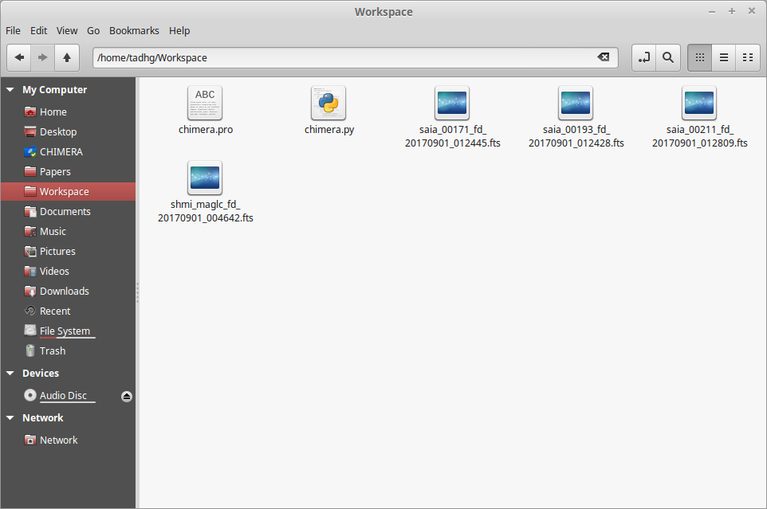
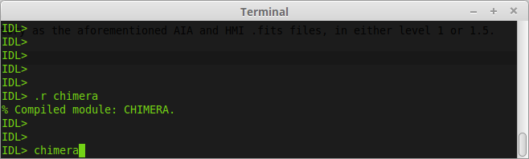
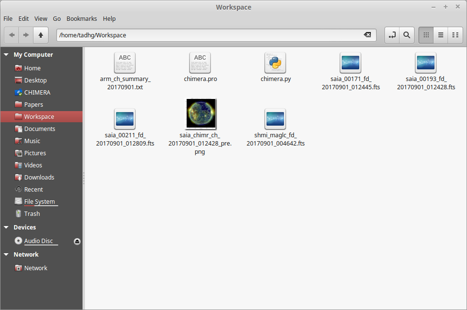
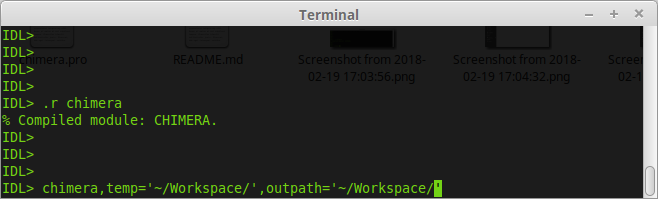

# CHIMERA
Library of SolarSoft IDL routines to identify and extract coronal holes and their properties from EUV images of the Sun.

Note: This algorithm requires use of the IDL programming language and the SolarSoft libraries

Author: Tadhg M. Garton

This algorithm extracts coronal hole (CH) boundaries and properties from 3 full-disk AIA EUV images centered at 171, 193, and 211A and a single HMI full disk magnetogram image with a similar observation time. To ensure correct functionality, CHIMERA should be stored and run from the same directory as the aforementioned AIA and HMI .fits files, in either level 1 or 1.5.

CHIMERA, in it's current form, only accepts AIA .fits files with wavelength information in the title, such as "00171", and HMI images with the keyword "hmi" in the title. CHIMERA cannot discern between multiple files with these naming conventions, so ensure only one copy of a 171, 193, 211A and HMI image are present. CHIMERA is now callable from an SSWIDL terminal as follows.

This call to CHIMERA creates 2 new files: a .png file of the full solar disk with CH regions segmented and labelled in sequential order of size, and a .txt file describing the properties extracted from these CH regions.

CHIMERA can access .fits files from other temporary locations using the "temp" keyword. This keyword accepts the string directory location of the .fits files to be used for segmentation. Similarly the output files can be stored in a specified directory using the keyword "outpath" with a similar syntax.

Any issues or queries on CHIMERA can be sent to: gartont@tcd.ie.
